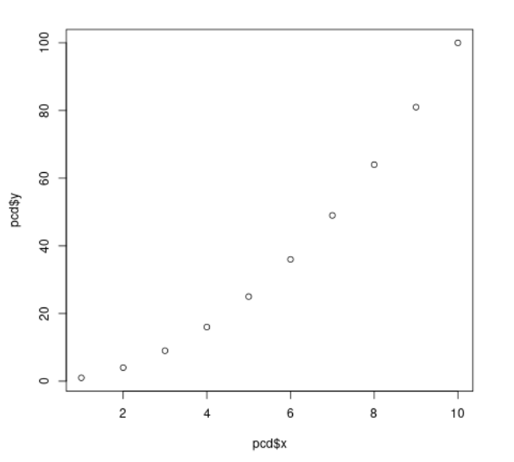
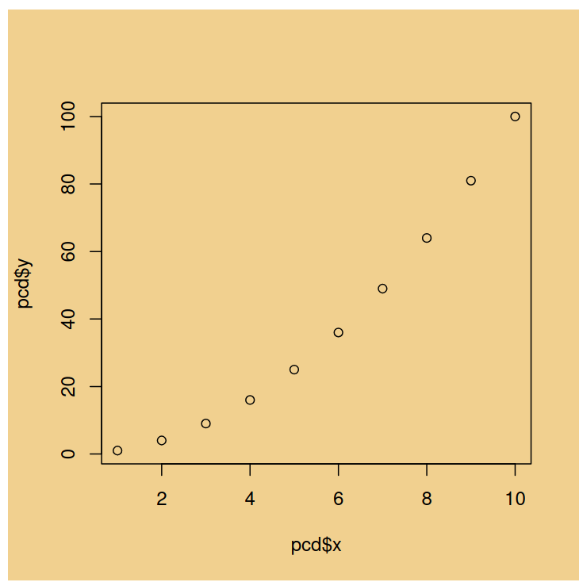

---
all_doc:
  pandoc_args: --resource-path=/home/dnlennon/Workspace/repos/metayer/vignettes
output:
  html_vignette:
    toc: yes
    toc_depth: 2
  html_document:
    theme: flatly
    highlight: tango
    pandoc_args: --resource-path=/home/dnlennon/Workspace/repos/metayer/vignettes
  pdf_document:
    pandoc_args: --resource-path=/home/dnlennon/Workspace/repos/metayer/vignettes
vignette: |
  %\VignetteIndexEntry{ authoring }
  %\VignetteEngine{knitr::rmarkdown}
  %\VignetteEncoding{UTF-8}
title: authoring
---

```{r setup, include = FALSE}
  library(magrittr)
  library(rlang)
  library(metayer)
```

```{r, include = FALSE}
  Sys.setenv(R_CONFIG_ACTIVE = "jupyter")

  # knitr options [ref](https://yihui.org/knitr/options/) documentation; 
  knitr::opts_chunk$set(
    metayer_hook = TRUE,
    comment = "",
    fig.path = "assets/knitr/",
    
    # c.f., _pkgdown \ templates \ includes
    class.output = c("sourceCode", "rOutput")
  )

  knitr::opts_knit$set(
    root.dir = here::here("vignettes")
  )

  knitr::knit_hooks$set(
    metayer_hook = knitr_metayer_hook
  )
```

## publishing context

This article addresses publishing context. The workflow scenario is
authoring documentation in a Jupyter notebook. The requirement is to
support rmarkdown html, rmarkdown pdf, and pkgdown article output.
Details of these document pipelines are in the appendix.

### jupyter header yaml

It can be convenient to have a copy and paste YAML header when creating
new jupyter documents.

``` yaml
---
title: "authoring"

all_doc: &shared
  pandoc_args: 
    - !with_env "--resource-path={R_HERE_HERE}/vignettes"

output:
  html_document:
    <<: *shared
    theme: cerulean
    highlight: espresso
  pdf_document:
    <<: *shared
---
```

Above, we show the defaults used by metayer. However, these are easily
changed via the config.yml file. Documentation is in the [configuration
vignette](./metayer-config.html)

## with_pander

`pander` converts to markdown. `with_pander` adds logging and context
dependent output.

```{r}
# convert to markdown, with a message
pander({
  message("hello, stderr")
  pcd
})
```

```{r}
# publishing context upgrade!
with_pander({
  message("hello, stderr.  hello, log.")
  pcd
})
```

`with_pander` can be used with plots. It does this by generates an image
file and injecting a markdown link. By default the image format is PNG,
which is fine for HTML, but isn't ideal for PDF output.

```{r}
# using with_pander to generate a PNG file
with_pander({
  plot(pcd$x, pcd$y)
})
```

However, a screen grab of PDF output illustrates the image scaling
artifacts that arise with a raster image.



## sure_plot

`sure_plot` addresses this concern by inspecting publishing context.
This ensures that an HTML document will be paired with png raster images
whereas a PDF document will be paired with svg vector images.

```{r}
# Produce a context aware plot
sure_plot(
  {
    plot(pcd$x, pcd$y)
  },
  height = 5,
  width = 5,
  res = 96,
  par_opts = list(bg = "#f1d08f")
)
```

And the corresponding screen grab from the PDF.



## appendix

### publishing formats

This snippet builds all three output formats:

``` r
article_name <- "authoring"

pub_ipynb_to_rmd(
  "./vignettes/authoring.ipynb",
  "./vignettes/authoring.Rmd"    
)

# create standalone html and pdf
rmarkdown::render(
  input = "./vignettes/authoring.Rmd",
  output_format = "all"
)

# build the pkgdown article
pkgdown::build_article("authoring")
```

### incremental results

Using knitr, we can convert from the Rmarkdown format to a regular
markdown file. This would be suitable for direct pandoc processing.

``` r
# be intentional about the image format
withr::with_options(
  list(knitr.chunk.dev = "jpeg"),
  {
    knitr::knit(
      "./vignettes/authoring.Rmd",
      "./vignettes/authoring_jpeg.md"
    )
  }
)
```
